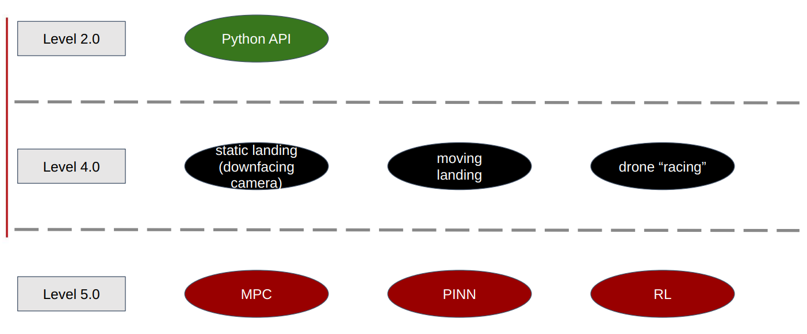

# Capstone_project_2_electric_boogaloo

This project was completed as part of the Automatic Control and Robotics Master's program at AGH University, within the Cyber-Physical Systems specialization.

The project focused on implementing one task from each level of the list below, to be completed on a DJI Tello drone using Python.
